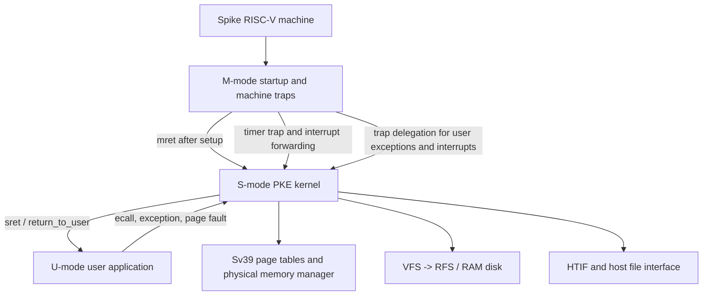

# HUST-OS-PKE-Project

中文 | [English](README_EN.md)

> 一个基于 RISC-V PKE（Proxy Kernel for Education）的操作系统课程实践仓库。

## 项目简介

本项目基于 HUST PKE，在 [Spike](https://github.com/riscv-software-src/riscv-isa-sim) 模拟的 RISC-V 机器上运行用户程序，并逐步补全一个“刚好够用”的 Proxy Kernel。它的目标是通过一组规模受控的实验理解操作系统机制，而不是实现一个可以替代 Linux 的完整内核。

仓库以实验分支保存实现过程。当前发布主线是 `lab4_3_hardlink`，包含从 Lab 1 到 Lab 4.3 的基础实现链；挑战实验保持在各自分支中，便于按阶段阅读和复现。

## 已实现的核心内容

- 特权级与陷阱：M-mode 启动、机器态异常、S-mode 陷阱入口、`ecall` 系统调用和返回值传递。
- 中断：机器态定时器中断、向 S-mode 转发软件中断，以及基于时钟 tick 的调度。
- 调试辅助：基于保存的 frame pointer 进行 backtrace；在挑战分支中解析 ELF/DWARF `.debug_line`，定位运行时错误的源码文件和行号。
- 多核状态：按 hart 分离机器栈、用户栈、内核栈、trap frame、`current` 和计时状态，并使用启动/退出同步。
- 虚拟内存：Sv39 三级页表遍历、虚拟地址到物理地址转换、页映射与解除映射、物理页分配和释放。
- 缺页与堆：按 `stval` 处理用户栈缺页；区分页面不存在和写权限/COW 类缺页。
- 进程与调度：进程地址空间、`fork`、`yield`、等待/回收、阻塞与唤醒、FIFO 就绪队列和 round-robin 调度。
- 进程间共享：Copy-on-Write，包括清除父子页表写权限、处理写缺页和复制物理页。
- 文件系统：VFS 接口、RAM disk 上的 RFS、文件读写、目录遍历、inode 生命周期和硬链接/解除硬链接。

> README 中的“完成”是按分支记录的：挑战分支不会自动合并到 `lab4_3_hardlink`，因此阅读某项实现时请切换到对应分支。

## 内核架构



- M-mode 负责启动、DTB/HTIF 初始化、陷阱委托和机器态定时器处理。
- S-mode 是 PKE 内核主体，负责系统调用、缺页处理、进程调度、内存管理和文件系统。
- U-mode 运行 `user/` 下的应用。应用通过 `ecall` 请求内核服务，异常返回后由 trap frame 恢复用户寄存器。
- 当前主线使用单 hart；多核实验在 `lab1_challenge3_multicore` 和 `lab2_challenge3_multicoremem` 中分别展示启动同步与地址空间/运行时状态隔离。

## 实验分支

| 阶段 | 分支 | 主要实现 |
| --- | --- | --- |
| Lab 1 | `lab1_1_syscall` | U-mode `ecall`、S-mode 系统调用分发和返回值 |
| Lab 1 | `lab1_2_exception` | M-mode 非法指令等异常处理 |
| Lab 1 | `lab1_3_irq` | 定时器中断、tick 和 S-mode 调度入口 |
| Lab 1 | `lab1_challenge1_backtrace` | 栈帧回溯、返回地址和 ELF 符号解析 |
| Lab 1 | `lab1_challenge2_errorline` | DWARF 源码行表、路径解析和 host 文件读取 |
| Lab 1 | `lab1_challenge3_multicore` | 双 hart 启动、每 hart 运行时资源和退出同步 |
| Lab 2 | `lab2_1_pagetable` | Sv39 页表、页表遍历和用户虚拟地址转换 |
| Lab 2 | `lab2_2_allocatepage` | 用户映射解除、物理页回收和简单堆基础 |
| Lab 2 | `lab2_3_pagefault` | 用户栈按需分配和 store page fault 处理 |
| Lab 2 | `lab2_challenge1_pagefaults` | 根据 `scause`、`stval` 和地址范围分类缺页 |
| Lab 2 | `lab2_challenge2_singlepageheap` | 暂缓：单页堆分配器实验未纳入当前完成范围 |
| Lab 2 | `lab2_challenge3_multicoremem` | 双 hart 的页表、`current`、trap frame 和运行时内存隔离 |
| Lab 3 | `lab3_1_fork` | 进程复制、子进程 trap frame 和地址空间建立 |
| Lab 3 | `lab3_2_yield` | `yield`、就绪队列和进程切换 |
| Lab 3 | `lab3_3_rrsched` | 时间片、tick accounting 和 round-robin |
| Lab 3 | `lab3_challenge1_wait` | 父子进程关系、阻塞等待和僵尸进程 |
| Lab 3 | `lab3_challenge2_semaphore` | 信号量计数、等待队列、阻塞与唤醒 |
| Lab 3 | `lab3_challenge3_cow` | Copy-on-Write 和写缺页复制 |
| Lab 4 | `lab4_1_file` | VFS/RFS 文件 inode、文件读写和文件描述符 |
| Lab 4 | `lab4_2_directory` | 目录 inode、目录项和 `readdir` |
| Lab 4 | `lab4_3_hardlink` | inode 复用、链接计数、硬链接和 unlink |

## 构建环境

需要以下工具：

- RISC-V GNU bare-metal 工具链，至少包含 `riscv64-unknown-elf-gcc`、`ar` 和相关 binutils；
- GNU Make；
- Spike RISC-V ISA simulator；
- 能够运行上述工具的 Linux 或 macOS 环境。

可以先检查：

```bash
which riscv64-unknown-elf-gcc
which spike
```

### 已验证的构建与运行命令

```bash
make clean
make march=-march=rv64imafd
spike --isa=rv64imafd obj/riscv-pke obj/app_hardlink
```

这里显式使用 `rv64imafd`，是因为较早版本的 PKE 启动代码与当前 Spike 默认的 compressed-ISA 配置存在兼容性问题。上述命令已经在 `lab4_3_hardlink` 上完成过实际构建和 Spike 运行验证。

`app_hardlink` 的成功输出应包含：

```text
All tests passed!
User exit with code:0.
System is shutting down with exit code 0.
```

其中 `All tests passed!` 是课程应用自身的功能检查输出；本项目没有新增测试文件，也没有把测试框架加入内核。

## 双 hart 分支验证

当前 `lab4_3_hardlink` 的 `NCPU` 为 1。双 hart 示例位于 `lab1_challenge3_multicore`，该分支提供 `app0`、`app1` 和双核 Makefile。可以这样复现：

```bash
git switch lab1_challenge3_multicore
make clean
make march=-march=rv64imafd
spike --isa=rv64imafd -p2 obj/riscv-pke obj/app0 obj/app1
```

重点观察：

1. 两个 hart 是否分别加载并运行自己的应用；
2. `stack`、`USER_STACK`、`USER_KSTACK`、trap frame 和 `current` 是否按 hart 分离；
3. 启动 barrier 是否保证共享初始化完成后再继续；
4. 一个 hart 结束时，Spike 是否不会在另一个 hart 尚未完成时提前关闭。

## 仓库结构

```text
.
├── kernel/             # S-mode PKE 内核和 M-mode 启动/陷阱代码
│   ├── machine/        # M-mode entry、初始化和 machine trap
│   ├── elf.c           # ELF 加载与用户程序初始化
│   ├── vmm.c           # Sv39 页表和虚拟内存
│   ├── process.c       # 进程、fork 和上下文切换
│   ├── sched.c         # 就绪队列和调度
│   ├── vfs.c           # VFS 层
│   └── rfs.c           # RAM disk 文件系统
├── user/               # 用户库和实验应用
├── spike_interface/    # HTIF、Spike 内存和 host 文件接口
├── util/               # 字符串、格式化和汇编辅助代码
├── hostfs_root/        # hostfs 示例根目录
├── docs/superpowers/   # 本次项目文档设计和执行计划
├── Makefile
└── LICENSE.txt
```

`obj/` 是构建生成目录，不属于源代码；执行 `make clean` 可以删除它。

## 已知限制与未完成范围

- PKE 是教学用 Proxy Kernel，不是完整的通用操作系统；很多资源回收、权限检查和错误处理都经过简化。
- 当前主线是单 hart；多核状态隔离只在对应 challenge 分支中实现和验证。
- RFS 是简化的 RAM disk 文件系统，主要覆盖本实验需要的直接数据块、目录项和 inode 操作。
- 用户堆、页表销毁、进程生命周期和并发同步仍不是生产级实现。
- `lab2_challenge2_singlepageheap` 暂缓。
- 以下分支不在本项目当前完成范围内：`lab4_challenge1_relativepath`、`lab4_challenge2_exec`、`lab4_challenge3_shell`、`lab5_1_poll`、`lab5_2_PLIC`、`lab5_3_hostdevice`。

## 源码导航

- [M-mode 初始化](kernel/machine/minit.c)
- [M-mode trap 处理](kernel/machine/mtrap.c)
- [S-mode trap 和系统调用入口](kernel/strap.c)
- [虚拟内存与 Sv39 页表](kernel/vmm.c)
- [进程与 fork](kernel/process.c)
- [调度器](kernel/sched.c)
- [ELF 用户程序加载](kernel/elf.c)
- [VFS 接口](kernel/vfs.c)
- [RFS 文件系统与硬链接](kernel/rfs.c)
- [硬链接应用示例](user/app_hardlink.c)
- [许可证](LICENSE.txt)
