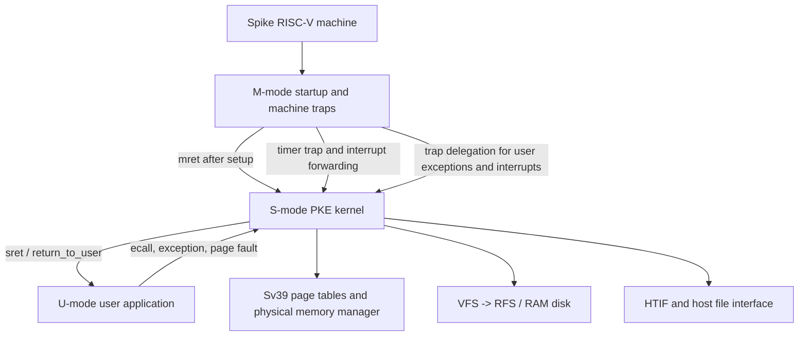

# HUST-OS-PKE-Project

[中文](README.md) | English

> A hands-on operating-systems project based on the RISC-V PKE (Proxy Kernel for Education).

## Project Overview

This repository is based on HUST PKE. It runs user applications on a RISC-V machine simulated by [Spike](https://github.com/riscv-software-src/riscv-isa-sim) and incrementally completes a small “just-enough” Proxy Kernel. The goal is to understand operating-system mechanisms through controlled lab-sized changes, not to build a general-purpose kernel that can replace Linux.

The repository preserves the implementation history in lab branches. The current release line is `lab4_3_hardlink`, which contains the basic implementation chain from Lab 1 through Lab 4.3. Challenge labs remain on their own branches so that each mechanism can be read and reproduced independently.

## Implemented Core Topics

- Privilege levels and traps: M-mode startup, machine exceptions, the S-mode trap entry, `ecall` system calls, and return-value propagation.
- Interrupts: machine timer interrupts, forwarding to an S-mode software interrupt, and tick-based scheduling.
- Debugging helpers: frame-pointer-based backtraces; on the challenge branch, ELF/DWARF `.debug_line` parsing to locate the source file and line of a runtime error.
- Multicore state: per-hart machine stacks, user stacks, kernel stacks, trap frames, `current` pointers, and timer state, with startup and shutdown synchronization.
- Virtual memory: Sv39 three-level page-table walking, virtual-to-physical translation, mapping and unmapping, and physical-page allocation/reclamation.
- Faults and heap: demand allocation for the user stack and classification of missing-page and write/COW-style page faults using `stval`.
- Processes and scheduling: process address spaces, `fork`, `yield`, wait/reclamation, blocking and wakeup, FIFO ready queues, and round-robin scheduling.
- Shared pages: Copy-on-Write, including write-protection of parent and child mappings, write-fault handling, and physical-page copying.
- Filesystems: VFS, the RAM-disk RFS, file I/O, directory traversal, inode lifetime, hard links, and unlink.

> “Implemented” is recorded per branch. Challenge branches are intentionally not merged into `lab4_3_hardlink`; switch to the relevant branch when studying one of those implementations.

## Kernel Architecture



- M-mode handles startup, DTB/HTIF initialization, trap delegation, and machine timer processing.
- S-mode is the PKE kernel proper: system calls, page faults, process scheduling, memory management, and filesystems.
- U-mode runs applications under `user/`. Applications request kernel services through `ecall`; after a trap, the trap frame restores user registers.
- The main line uses one hart; multicore labs separately demonstrate startup synchronization and isolation of address spaces/runtime state in `lab1_challenge3_multicore` and `lab2_challenge3_multicoremem`.

## Lab Branches

| Stage | Branch | Main implementation |
| --- | --- | --- |
| Lab 1 | `lab1_1_syscall` | U-mode `ecall`, S-mode syscall dispatch, and return values |
| Lab 1 | `lab1_2_exception` | M-mode illegal-instruction and related exception handling |
| Lab 1 | `lab1_3_irq` | Timer interrupts, ticks, and the S-mode scheduling entry |
| Lab 1 | `lab1_challenge1_backtrace` | Stack unwinding, return addresses, and ELF symbol parsing |
| Lab 1 | `lab1_challenge2_errorline` | DWARF line tables, path resolution, and host-file reads |
| Lab 1 | `lab1_challenge3_multicore` | Two-hart startup, per-hart runtime state, and shutdown synchronization |
| Lab 2 | `lab2_1_pagetable` | Sv39 page tables, page walks, and user virtual-address translation |
| Lab 2 | `lab2_2_allocatepage` | User unmapping, physical-page reclamation, and simple-heap foundations |
| Lab 2 | `lab2_3_pagefault` | Demand allocation for user-stack pages and store page faults |
| Lab 2 | `lab2_challenge1_pagefaults` | Fault classification using `scause`, `stval`, and address ranges |
| Lab 2 | `lab2_challenge2_singlepageheap` | Paused: the single-page heap allocator is outside the completed scope |
| Lab 2 | `lab2_challenge3_multicoremem` | Per-hart page tables, `current`, trap frames, and runtime-memory isolation |
| Lab 3 | `lab3_1_fork` | Process cloning, child trap frames, and address-space construction |
| Lab 3 | `lab3_2_yield` | `yield`, ready queues, and context switching |
| Lab 3 | `lab3_3_rrsched` | Time slices, tick accounting, and round-robin scheduling |
| Lab 3 | `lab3_challenge1_wait` | Parent/child relationships, blocking wait, and zombie processes |
| Lab 3 | `lab3_challenge2_semaphore` | Semaphore counts, wait queues, blocking, and wakeup |
| Lab 3 | `lab3_challenge3_cow` | Copy-on-Write and write-fault copying |
| Lab 4 | `lab4_1_file` | VFS/RFS file inodes, file I/O, and file descriptors |
| Lab 4 | `lab4_2_directory` | Directory inodes, directory entries, and `readdir` |
| Lab 4 | `lab4_3_hardlink` | Inode reuse, link counts, hard links, and unlink |

## Build Environment

Required tools:

- A RISC-V GNU bare-metal toolchain containing `riscv64-unknown-elf-gcc`, `ar`, and the related binutils;
- GNU Make;
- the Spike RISC-V ISA simulator;
- a Linux or macOS environment capable of running those tools.

Check the key executables first:

```bash
which riscv64-unknown-elf-gcc
which spike
```

### Verified build and run command

```bash
make clean
make march=-march=rv64imafd
spike --isa=rv64imafd obj/riscv-pke obj/app_hardlink
```

The explicit `rv64imafd` is used because the older PKE startup code has compatibility issues with the compressed-ISA configuration used by current Spike defaults. The command above has been run successfully on `lab4_3_hardlink`, including a real Spike execution.

A successful `app_hardlink` run includes:

```text
All tests passed!
User exit with code:0.
System is shutting down with exit code 0.
```

The `All tests passed!` line is the course application's own functional-check output. This project adds no test files and does not add a test framework to the kernel.

## Two-Hart Branch Verification

The current `lab4_3_hardlink` branch has `NCPU` set to 1. The two-hart example is on `lab1_challenge3_multicore`, which provides `app0`, `app1`, and a two-hart Makefile:

```bash
git switch lab1_challenge3_multicore
make clean
make march=-march=rv64imafd
spike --isa=rv64imafd -p2 obj/riscv-pke obj/app0 obj/app1
```

Check that:

1. both harts load and run their own applications;
2. `stack`, `USER_STACK`, `USER_KSTACK`, trap frames, and `current` are separated per hart;
3. the startup barrier prevents later work from using shared state before initialization finishes;
4. Spike does not shut down when one hart finishes while the other still has work.

## Repository Layout

```text
.
├── kernel/             # S-mode PKE kernel and M-mode startup/trap code
│   ├── machine/        # M-mode entry, initialization, and machine traps
│   ├── elf.c           # ELF loading and user-program setup
│   ├── vmm.c           # Sv39 page tables and virtual memory
│   ├── process.c       # Processes, fork, and context switching
│   ├── sched.c         # Ready queues and scheduling
│   ├── vfs.c           # VFS layer
│   └── rfs.c           # RAM-disk filesystem
├── user/               # User library and lab applications
├── spike_interface/    # HTIF, Spike memory, and host-file interfaces
├── util/               # String, formatting, and assembly helpers
├── hostfs_root/        # Example hostfs root directory
├── docs/superpowers/   # Project documentation design and execution plan
├── Makefile
└── LICENSE.txt
```

`obj/` is a generated build directory and is not source code; `make clean` removes it.

## Known Limitations and Out-of-Scope Work

- PKE is an educational Proxy Kernel, not a complete general-purpose operating system; resource reclamation, permission checks, and error handling are intentionally simplified.
- The main line is single-hart; multicore state isolation is implemented and verified only on the corresponding challenge branches.
- RFS is a small RAM-disk filesystem covering the direct blocks, directory entries, and inode operations needed by these labs.
- The user heap, page-table teardown, process lifetime management, and concurrent synchronization are not production-grade implementations.
- `lab2_challenge2_singlepageheap` is paused.
- The following branches are outside the current completed scope: `lab4_challenge1_relativepath`, `lab4_challenge2_exec`, `lab4_challenge3_shell`, `lab5_1_poll`, `lab5_2_PLIC`, and `lab5_3_hostdevice`.

## Source Map

- [M-mode initialization](kernel/machine/minit.c)
- [M-mode trap handling](kernel/machine/mtrap.c)
- [S-mode trap and syscall entry](kernel/strap.c)
- [Virtual memory and Sv39 page tables](kernel/vmm.c)
- [Processes and fork](kernel/process.c)
- [Scheduler](kernel/sched.c)
- [ELF user-program loader](kernel/elf.c)
- [VFS interface](kernel/vfs.c)
- [RFS filesystem and hard links](kernel/rfs.c)
- [Hard-link application example](user/app_hardlink.c)
- [License](LICENSE.txt)
